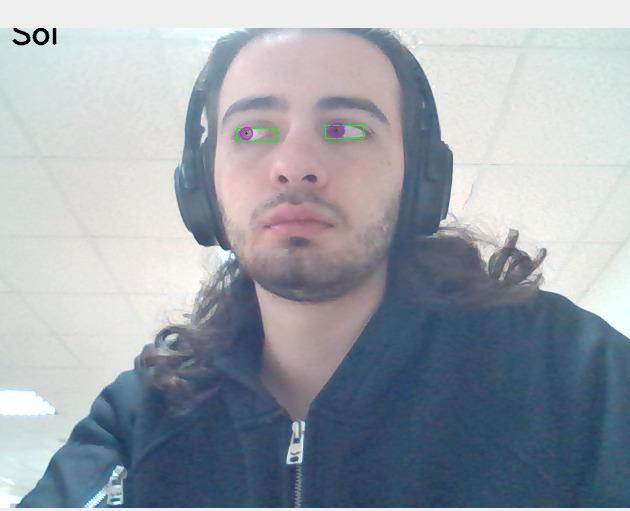
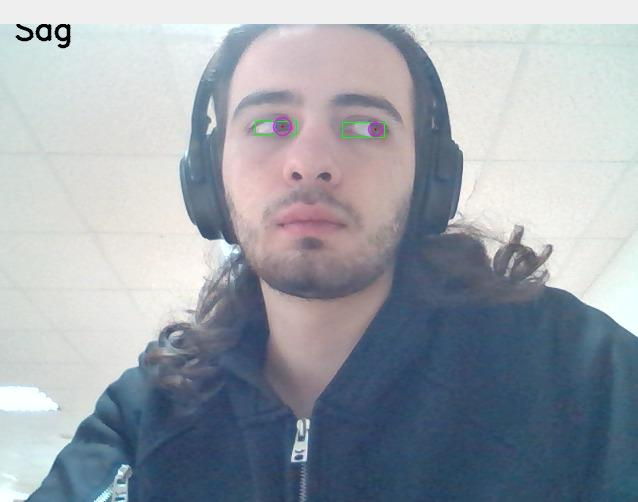
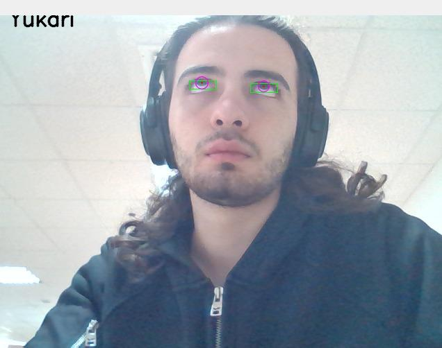
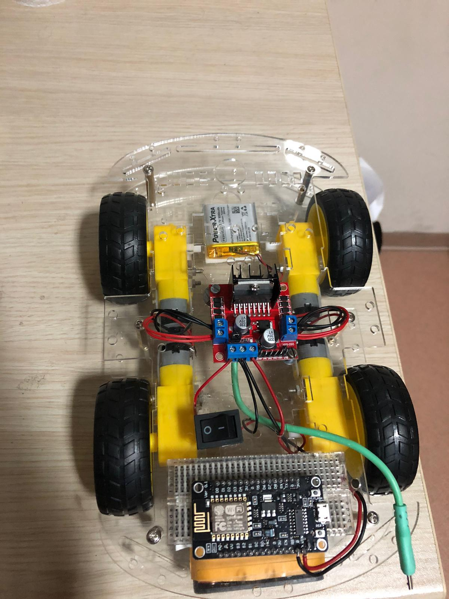

# EYE-CONTROLLED ROBOT CAR

[](https://www.buymeacoffee.com/kursatkomurcu)

In this project, a robot car was controlled by eye movements. The project contains two stage. Eye detection and robot car control.

### Eye & Gaze Detection

Mediapipe library iris detection model (based mobilenet architecture) was used for eye detection. Here is eye and iris landmarks:

```python
LEFT_EYE =[ 362, 382, 381, 380, 374, 373, 390, 249, 263, 466, 388, 387, 386, 385, 384, 398 ]

RIGHT_EYE=[ 33, 7, 163, 144, 145, 153, 154, 155, 133, 173, 157, 158, 159, 160, 161 , 246 ]

LEFT_IRIS = [474, 475, 476, 477]

RIGHT_IRIS = [469, 470, 471, 472]
```

We get center of iris after detection.

```python
(l_cx, l_cy), l_radius = cv2.minEnclosingCircle(mesh_points[LEFT_IRIS])

(r_cx, r_cy), r_radius = cv2.minEnclosingCircle(mesh_points[RIGHT_IRIS])

center_left = np.array([l_cx, l_cy], dtype=np.int32)

center_right = np.array([r_cx, r_cy], dtype=np.int32)
```

Frames divided by 9 pieces for gaze detection.

```python
command = None

if(center_left[1] < (yl + (2*hl/3)) and center_left[1] > (yl + (hl/3)) and center_left[0] < (xl + (2*wl/3)) and center_left[0] > (xl + (wl/3))):

​        frame = cv2.putText(frame, "Center", (15, 15), cv2.FONT_HERSHEY_SIMPLEX, 1, (0, 0, 0), 2, cv2.LINE_AA)

​        command = "Center" #stop

        print(command)

elif(center_left[1] < (yl + (hl/3)) and center_left[1] > (yl) and center_left[0] < (xl + (wl/3)) and center_left[0] > (xl)):

        frame = cv2.putText(frame, "Upper Left", (15, 15), cv2.FONT_HERSHEY_SIMPLEX, 1, (0, 0, 0), 2, cv2.LINE_AA)

        command = "Upper Left"

        print(command)

elif(center_left[1] < (yl + (hl/3)) and center_left[1] > (yl) and center_left[0] < (xl + (2*wl/3)) and center_left[0] > (xl+ (wl/3))):

​        frame = cv2.putText(frame, "Up", (15, 15), cv2.FONT_HERSHEY_SIMPLEX, 1, (0, 0, 0), 2, cv2.LINE_AA)

​        command = "Up"

​        print(command)

elif(center_left[1] < (yl + (hl/3)) and center_left[1] > (yl) and center_left[0] < (xl + wl) and center_left[0] > (xl + (2*hl/3))):

​	frame = cv2.putText(frame, "Upper Right", (15, 15), cv2.FONT_HERSHEY_SIMPLEX, 1, (0, 0, 0), 2, cv2.LINE_AA)

​        command = "Upper Right"

​        print(command)

elif(center_left[1] < (yl + hl) and center_left[1] > (yl + (2*hl/3)) and center_left[0] < (xl + (wl/3)) and center_left[0] > (xl)):

​	frame = cv2.putText(frame, "Left Down", (15, 15), cv2.FONT_HERSHEY_SIMPLEX, 1, (0, 0, 0), 2, cv2.LINE_AA)

​        command = "Left Down"

​        print(command)

elif(center_left[1] < (yl + hl) and center_left[1] > (yl + (2*hl/3)) and center_left[0] < (xl + (2*wl/3)) and center_left[0] > (xl + (wl/3))):

​	frame = cv2.putText(frame, "Down", (15, 15), cv2.FONT_HERSHEY_SIMPLEX, 1, (0, 0, 0), 2, cv2.LINE_AA)

​        command = "Down"

​        print(command)

elif(center_left[1] < (yl + hl) and center_left[1] > (yl + (2*hl/3)) and center_left[0] < (xl + wl) and center_left[0] > (xl + (2*wl/3))):
        
        frame = cv2.putText(frame, "Right Down", (15, 15), cv2.FONT_HERSHEY_SIMPLEX, 1, (0, 0, 0), 2, cv2.LINE_AA)

        command = "Right Down"

        print(command)

elif(center_left[1] < (yl + (2*hl/3)) and center_left[1] > (yl + (hl/3)) and center_left[0] < (xl + (wl/3)) and center_left[0] > (xl)):

        frame = cv2.putText(frame, "Left", (15, 15), cv2.FONT_HERSHEY_SIMPLEX, 1, (0, 0, 0), 2, cv2.LINE_AA)

​        command = "Left"

        print(command)

elif(center_left[1] < (yl + (2*hl/3)) and center_left[1] > (yl + (hl/3)) and center_left[0] < (xl + wl) and center_left[0] > (xl + (2*wl/3))):

​	frame = cv2.putText(frame, "Right", (15, 15), cv2.FONT_HERSHEY_SIMPLEX, 1, (0, 0, 0), 2, cv2.LINE_AA)

​        command = "Right"

​        print(command)

else:

        command = "Empty Package"`

​        print(command)

```

  
        


**Command** variable is sended to ESP8266 Microcontroller via UDP after detecting gaze.


### Robot Car Control

Firstly robot car need to connect same WiFi with the platform that run eye detection code. 

```python
wlan = network.WLAN(network.STA_IF)

wlan.active(True)

wlan.connect("Ssid", "password")
```

Udp receiver get command variable that come from eye detection code. Then, the motors of the robot car are controlled according to the command variable.

```python
class DCMotor:

​    def __init__(self, pin1, pin2, enable_pin1, min_duty=750, max_duty=1023):

        self.pin1 = pin1

​        self.pin2 = pin2

​        self.enable_pin1 = enable_pin1

​        self.min_duty = min_duty

​        self.max_duty = max_duty


​    def forward(self, speed):

​        self.speed = speed

​        self.enable_pin1.duty(self.duty_cycle(self.speed))

​        self.pin1.value(1)

​        self.pin2.value(0)


​    def backwards(self, speed):

​        self.speed = speed

​        self.enable_pin1.duty(self.duty_cycle(self.speed))

​        self.pin1.value(0)

​        self.pin2.value(1)


​    def stop(self):

​        self.enable_pin1.duty(0)

​        self.pin1.value(0)

​        self.pin2.value(0)


​    def duty_cycle(self, speed):

​        if self.speed <= 0 or self.speed > 100:

​            duty_cycle = 0

​        else:

​            duty_cycle = int(self.min_duty + (self.max_duty - self.min_duty) * ((self.speed - 1) / (100 - 1)))

​            return duty_cycle
```



### How to run?

First run **esp8266_motor_control.py** code. After the code is run, the ip address of esp8266 will be seen in the terminal. The ip address and port must be the same as the following line in the **mediapipe_eye_detection.py** code.

```python
serverAddressPort = ("192.168.77.9", 20001)
```

Then run **mediapipe_eye_detection.py** code.
